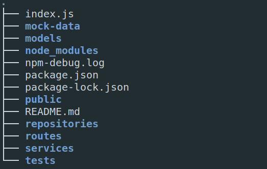

# Online shopping mall api



- routes : URL별로 라우터 분리
- services : 비즈니스 로직 구현
- models : DB 스키마 모델링
- repositories : DB와 API서버의 interface

## Quck Start

```bash
git clone https://github.com/passwd10/shopping-mall-api.git
npm install
npm start
```

## 사용 기술

- Node.JS
- express
- npm
- MongoDB
- Docker
- Linux

## 배포

- API서버 : Heroku
- MongoDB : Atlas
